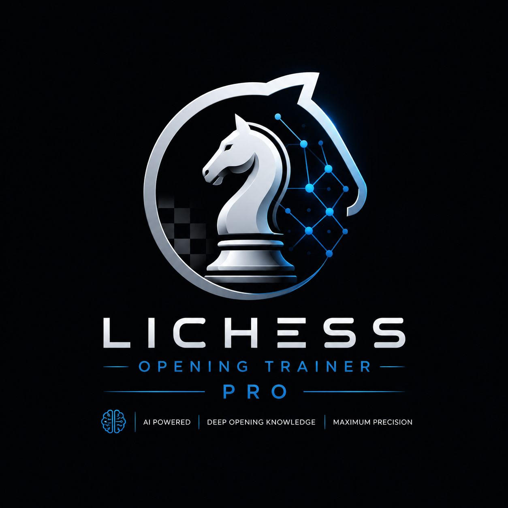

<div style="margin-left: 50px">
<table border="0" cellpadding="0" cellspacing="0">
<tr>
<td width="110" valign="middle">

</td>
<td valign="middle">
<h1>Lichess Opening Trainer Pro</h1>
<strong>Sistema de Análisis Inteligente de Repertorio de Ajedrez con Machine Learning</strong>
</td>
</tr>
</table>

[](https://python.org)
[](https://streamlit.io)
[](https://scikit-learn.org)
[](https://stockfishchess.org)
[](LICENSE)

</div>

---

## 📋 Descripción del Proyecto

Sistema que analiza el repertorio completo de un jugador de Lichess para:
- **Categorizar desempeño** por apertura (Blancas/Negras)
- **Identificar aperturas de éxito natural** (bajo conocimiento teórico + alta precisión)
- **Detectar puntos críticos** (alto volumen + baja precisión)
- **Recomendar recursos** personalizados según nivel y debilidades

### 🔬 Flujo de Datos
1. **Ingesta:** Descarga de partidas vía API Lichess (Rating incluido)
2. **Análisis Teórico:** Cruce con DB local (327K posiciones GM) → identifica fin de teoría (máx. 15 jugadas)
3. **Análisis de Rendimiento:** Stockfish evalúa 12 jugadas post-teoría → mide CP loss + Accuracy
4. **Clustering:** KMeans (K=3) categoriza nivel por apertura → *sin_base*, *desarrollo*, *dominio*
5. **Recomendación:** Sistema de 3 prioridades para recursos (libros/cursos/videos)

---

## 🎬 Demo

<div align="center">


*Flujo completo: Análisis de repertorio → Clustering automático → Recomendaciones personalizadas*

</div>

**Ejemplo de análisis:**
- Usuario: `tu_nick_de_lichess`
- Partidas analizadas: 150
- Tiempo: ~4 minutos (Stockfish local, depth=16)
- Resultado: 12 aperturas categorizadas, 8 recursos recomendados, 5 blunders detectados

---

## 🚀 Instalación Rápida

### 1. Clonar el Repositorio
```bash
git clone https://github.com/tu-usuario/lichess-opening-trainer-pro.git
cd lichess-opening-trainer-pro
```

### 2. Crear Entorno Virtual
```bash
python -m venv venv
source venv/bin/activate  # En Windows: venv\Scripts\activate
```

### 3. Instalar Dependencias
```bash
pip install -r requirements.txt
```

### 4. **⚠️ CRÍTICO: Descargar Archivos Pesados**

Los siguientes archivos **NO están en GitHub** por tamaño (total ~80-120 MB):

#### 📦 Descarga Automática
```bash
python setup_data.py
```

Este script descargará automáticamente:
- ✅ `stockfish-windows-x86-64-avx2.exe` (motor de análisis)
- ✅ `theory_db.pkl` (base de datos teórica con 327K posiciones)
- ✅ Datasets CSV de ejemplo

---

## 📁 Estructura del Proyecto

```
Lichess-Opening-Trainer-Pro/
│
├── app_16.py                              # 🎯 Aplicación principal Streamlit
├── requirements.txt                       # ✅ Dependencias Python
├── README.md                              # ✅ Este archivo
├── LICENSE.txt                            # ✅ Licencia MIT
├── .gitignore                             # ✅ Configuración Git
├── Chess_Orchestrator_v2.ipynb            # ✅ Notebook de orquestación
├── generar_graficas_presentacion.py       # ✅ Script de visualización
│
├── src/
│   ├── data/
│   │   ├── CSV/
│   │   │   ├── chess_resources_v3.csv           # ✅ Catálogo 900+ recursos
│   │   │   ├── blunders_pendientes.csv          # ✅ Template blunders
│   │   │   ├── master_dataset_ml.csv            # ⚠️ Dataset principal (generado)
│   │   │   ├── master_game_level_ml.csv         # ⚠️ Partidas con nivel (generado)
│   │   │   ├── user_opening_profiles.csv        # ⚠️ Perfiles usuario (generado)
│   │   │   ├── clustering_*.csv                 # ⚠️ Métricas clustering (generado)
│   │   │   └── validation_*.csv                 # ⚠️ Validación modelos (generado)
│   │   │
│   │   ├── PKL/
│   │   │   ├── km_apertura_pura_v2.pkl          # ✅ Modelo KMeans K=3
│   │   │   ├── scaler_apertura_pura_v2.pkl      # ✅ Scaler normalización
│   │   │   ├── cluster_label_mapping_v2.pkl     # ✅ Mapeo etiquetas
│   │   │   └── theory_db.pkl                    # ❌ DESCARGAR - 327K posiciones
│   │   │
│   │   ├── Libro aperturas/
│   │   │   └── lichess_elite_2025-*.pgn         # ❌ Opcional - PGNs elite (10 archivos)
│   │   │
│   │   └── Backups/                             # ⚠️ Generado automáticamente
│   │
│   ├── model/
│   │   └── production/
│   │       ├── chess_analyst_5.py               # ✅ Sistema análisis principal
│   │       ├── kmeans_apertura.joblib           # ✅ Modelo clustering
│   │       ├── scaler_apertura.joblib           # ✅ Scaler producción
│   │       ├── decision_tree_aperturas.pkl      # ✅ Árbol decisión
│   │       ├── chess_level_classifier.joblib    # ✅ Clasificador nivel
│   │       └── metadata.json                    # ✅ Metadatos modelo
│   │
│   ├── notebooks/
│   │   ├── MODELOS_ML.ipynb                     # ✅ Desarrollo modelos ML
│   │   ├── EDA_Recomendador_Material.ipynb      # ✅ Análisis exploratorio
│   │   ├── Creacion de datos y esqueleto del programa.ipynb  # ✅ Pipeline inicial
│   │   ├── Scraping/
│   │   │   ├── Chess_Scraper.ipynb              # ✅ Scraper recursos chess
│   │   │   └── Scraper Telegram.ipynb           # ✅ Scraper alternativo
│   │   └── mergear_recursos_v3.py               # ✅ Merge de datos
│   │
│   └── util/
│       ├── chess_intelligence_system.py         # ✅ Motor análisis Stockfish
│       ├── orquestador.py                       # ✅ Orquestador tareas
│       └── chess_game_level_augmentation.py     # ✅ Augmentación datos
│
└── resources/
    ├── engines/
    │   ├── stockfish-windows-x86-64-avx2.exe    # ❌ DESCARGAR - Motor Stockfish
    │   └── .gitkeep                             # ✅ Mantiene carpeta
    │
    ├── img/                                     # ✅ Assets visuales
    │   ├── Logo.jpg                             # Logo principal
    │   ├── GIF Video Programa.gif               # Demo animada
    │   ├── Infografia Chess.png                 # Arquitectura sistema
    │   ├── Nivel del usuario.png                # Visualización clustering
    │   └── [20+ gráficas análisis]
    │
    ├── profesor_virtual.py                      # ✅ Componente Profesor Virtual
    ├── tablero_profesional.py                   # ✅ Renderizador SVG tablero
    ├── demo_completo.py                         # ✅ Script demostración
    ├── Presentacion_FINAL.html                  # ✅ Presentación proyecto
    └── Memoria Lichess Opening Trainer Pro.odt  # ✅ Documentación técnica
```

**Leyenda:**
- ✅ Incluido en GitHub
- ⚠️ Excluido (se genera al ejecutar)
- ❌ Excluido (descargar manualmente)

---

## 🔑 Configuración de API Lichess

Para descargar tus propias partidas:

1. Generar token en: https://lichess.org/account/oauth/token
2. Crear archivo `.env` en la raíz:
```env
LICHESS_TOKEN=tu_token_aqui
```

---

## 📊 Uso del Sistema

### 1. Análisis de Usuario
```python
# En la interfaz Streamlit:
1. Ingresar nombre de usuario de Lichess
2. Seleccionar número de partidas (50-200 recomendado)
3. Clic en "Analizar Repertorio"
```

### 2. Dashboard de Resultados
- **Tab Dashboard:** Visualización de categorías de aperturas
  - 🔴 **Riesgo:** Risk_Index alto + Accuracy baja
  - 🟢 **Dominio:** Score_Prep alto + Accuracy alta
  - 🟡 **Feeling Natural:** Poca teoría + buena accuracy

- **Tab Plan de Estudio:** Recursos recomendados personalizados
- **Tab Blunders:** Errores graves (>100cp) para revisión

---

## 🧪 Tecnologías Utilizadas

```python
# Core
streamlit==1.32.0        # Framework web
python-chess==1.999      # Librería de ajedrez
stockfish==3.28.0        # Wrapper de Stockfish

# Data Science
pandas==2.2.0
numpy==1.26.4
scikit-learn==1.4.0      # KMeans clustering
joblib==1.3.2            # Persistencia de modelos

# API & Networking
berserk==0.13.2          # Cliente API Lichess
requests==2.31.0
```

---

## 📈 Métricas del Sistema

### Clustering KMeans (K=3)
- **Features:** `Fin_Teoria`, `acl_winsorized`, `game_prep_score`, `game_risk_index`
- **Niveles:** `sin_base` / `desarrollo` / `dominio`

### Accuracy Formula (Lichess)
```python
Accuracy = 103.1668 * exp(-0.04354 * ACL) - 3.1669
```

### Sistema de Recomendación (3 Prioridades)
1. **P1:** Apertura exacta + nivel usuario
2. **P2:** Apertura exacta + cualquier nivel
3. **P3:** Recursos generales (tácticas, estrategia)

---

## 🤝 Contribuciones

Este es un proyecto académico. Para mejoras:
1. Fork del repositorio
2. Crear branch: `git checkout -b feature/nueva-funcionalidad`
3. Commit: `git commit -am 'Añadir funcionalidad X'`
4. Push: `git push origin feature/nueva-funcionalidad`
5. Crear Pull Request

---

## 🐛 Problemas Conocidos

### ⚠️ Stockfish no encontrado
```bash
Error: Stockfish engine not found at resources/engines/
```
**Solución:** Ejecutar `python setup_data.py` o descargar manualmente

### ⚠️ theory_db.pkl no encontrado
```bash
FileNotFoundError: src/data/PKL/theory_db.pkl
```
**Solución:** Descargar desde el enlace proporcionado en la sección de instalación

### ⚠️ API Lichess rate limit
```bash
Error 429: Too Many Requests
```
**Solución:** Reducir número de partidas o esperar 60 segundos

---

<div align="center">

## 👤 Autor

**Eneko Ostolozaga**  
Bootcamp Data Science e IA Generativa · 2026

---

## 📝 Licencia

Distribuido bajo licencia MIT. Consulta el archivo [LICENSE](LICENSE) para más detalles.

---

